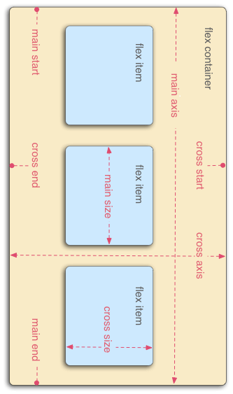

## 移动端适配方案

### 1. 适配元素
    (1) 字体
    (2) 宽高
	(3) 间距
	(4) 图像（图标、图片）

### 2. 适配方法
    (1) 百分比适配
	(2) 比例缩放适配
	(3) viewport适配
	(4) rem适配(常用)
	(5) 弹性布局适配(flex布局)

### 3. 适配方法特点
* 百分比适配

  百分比布局问题：

	(1)百分比的值不好计算

	(2)需要确定父级的大小，因为要根据父级的大小进行计算

	(3)宽度可以设置，但是高度不好设置
    
	一般情况下百分比布局是需要配合其它的布局而用
	
* 比例缩放适配 

	——把所有机型的设备独立像素设置成一致的（以前淘宝用的是这种方法）

步骤:

	(1)viewport需要通过js动态的设置（不能直接把device的值设置成数值）
	(2)通过设置比例（初始比例以及缩放比例），把宽度缩放成一致的
	例： 
	/*
	* iphone 6plus				
	* 原来的尺寸		curWidth		414
	* 要变成的尺寸   targetWidth	   375
	* 比例		  scale			   ?
	* 
	* 414/比例=375
	* 比例=414/375
	* 
	* 比例=curWidth/targetWidth;
	*/
```js
	var curWidth=window.screen.width;
	var targetWidth=375;
	var scale=curWidth/targetWidth;			
	var meta=document.createElement("meta");
	meta.name='viewport';
	meta.content='initial-scale='
				+scale
				+',minimum-scale='
				+scale
				+',maximum-scale='
				+scale+'';
	document.head.appendChild(meta);
	
```
`注意`：

	viewport里给了缩放的值以后，最终的页面的宽度是拿原来的值除以缩放比例，而不是乘以缩放比例
				
`缺点`：

	(1)就像在讲viewport设置宽度的时候，可以把宽度设置成一个固定值一样，会出现所有的手机看上去都是同样的大小，没有分别了，不太好
	(2)算出的的值在一些有小数的情况下可能会出现误差（无关紧要），因为设备独立像素不能有小数

* viewport适配

	——根据dpi的值，把视口进行缩放，缩放到物理像素，也就是把屏幕的尺寸直接设置成它对应的物理像素。
	https://m.taobao.com	淘宝在用，不过他只处理了dpi为2的几个设置，以及iphone6 plus
```
	/*
	 * 320/scale=640
	 * 375/scale=750
	 * 414/scale=1242
	 * 
	 * scale=320/640		1/2
	 * scale=375/750		1/2
	 * scale=414/1242		1/3
	 * 
	 * 
	 * scale的值=1/dpr
	 */
```
```js	
	var scale=1/window.devicePixelRatio;			
	var meta=document.createElement("meta");
	meta.name='viewport';
	meta.content='initial-scale='
				+scale
				+',minimum-scale='
				+scale
				+',maximum-scale='
				+scale
				+'';
    document.head.appendChild(meta);
```
`缺点`：

	(1) 这种方法有时候不准确，比如dpi不为整数的时候，会出现除不尽的情况，那缩放的倍数就会出现很长的小数，再去算物理像素的时候就会有误差
	(2) 如果屏幕的分辨率是非标准的话，算出的物理像素就是非标准的

* rem适配

	rem布局

		(1) 必需动态的去设置html的大小，才能适配
		(2) 根据页面(注意：是psd图，也就是真实大小大)的宽度除以一个系数，把算出的这个值赋给html的font-size属性
		注意：
			a. 为什么要除一个数字，原因是：一个页面里，不可能全都是整屏的元素，肯定有一行中放多个元素。所以就把一行分成n份
			b. 不除一个数字的话，那1个rem就是屏幕的宽度，这个值太大，如果一个元素的宽度比它小的话，就不方便计算
			c. 这个系数，自己定。多少都可以，但是建议给一个能整除的值
				
	特点：

		(1) 所有有单位的属性会根据屏幕的尺寸自动计算大小
		(2) 同样一个元素，在不同的设备下的大小是不一样的。在尺寸小的设备下显示的小，在尺寸大的设备下显示的大
		(3) 一般以iphone6为基准，以它的宽度750除上一个系数，再去算rem

	```js
	(function(){
		var html=document.documentElement;
		var width=html.getBoundingClientRect().width;
		html.style.fontSize=width/16+'px';
	})();
	```

* 弹性布局 (flex布局)

	1、 兼容问题

		IE10及以上、ios9(iphone4和iphone5未升级)及以上、android4.4及以上版本支持

	2、 特点

		(1)默认所有子元素都会在一行中显示，即使给子元素一个很大的宽度
		(2)父级加了这条属性，子级的float、vertical-align就会失效
		(3)如果兼容低版本的机型要加前缀-webkit-，包括后面讲的所有属性
		
	3、 容器属性（父元素样式）

	 字段 | 描述
    -| - 
		flex-direction | 子元素排列方向（主轴的方向）
		flex-wrap |	换行方式
		flex-flow |	以上两种方式的简写
		justify-content	| 水平对齐方式（子元素在主轴上的对齐方式）
		align-items	| 垂直对齐方式（子元素在交叉轴上的对齐方式）
		align-content |	多行垂直对齐方式（多根轴线的对齐方式）
	- | 

	4、 项目属性（子元素样式）

	 字段 | 描述
    -| - 
		order |	排列位置
		flex-grow |	扩展比例
		flex-shrink | 收缩比例
		flex-basis | 元素的大小
		flex | 以上三个属性的简写
		align-self | 单独的垂直对齐方式（交叉轴方向上）
	- | 
* 相关布局元素

	1、排列方向

 	字段 | 描述
    -| - 
		flex-direction |	子元素的排列方向
		row | 横着排  `注意：给了这个属性，即使子元素的宽度之和要比父级大，它也会在一行中排列，并且会把子元素的宽度自动缩小`
		row-reverse |  横着排，从右到左，反向
		column | 竖着排，从上到下
		column-reverse | 竖着排，从下到上
	- | 

	`注意：竖着排是把水平的主轴给旋转了90度`

	`原图主轴图`
	
		 
	

	`旋转后主轴图`’
	<div align=center>
		 
	</div>
	
	`排列方向图`
	 


	2、 换行方式

		字段 | 描述
		-| - 
		flex-wrap |	子元素的换行方式
		nowrap(默认值)|	不换行 (`所有子元素始终都在一行显示，不管父级宽度能否放的下`;`如果父级宽度放不下所有子元素，会把子元素宽度收缩(原理是后面要说的收缩比例)`)
		wrap | 换行，第一行在上方(从上到下，正序)
		wrap-reverse | 换行，第一行在下方(从下到上，倒序)
	 	|
				
	3、 水平对齐方式
		
		字段 | 描述
		-| - 
		justify-content	| 子元素的水平(主轴)对齐方式
		flex-start(默认值) | 左对齐
		flex-end | 右对齐
		center | 居中对齐
		space-between |	左右两端对齐，元素之间的间隔自动平分
		space-around | 左右分散居中对齐，每个元素两侧的间隔相等
		|
		
		
		注意：让元素竖着排，其实是把主轴旋转了90度，竖着排的元素依然可以使用justify-content去对齐

	水平对齐如图所示

	

	4、 垂直对齐

		字段 | 描述
		-| - 
		 align-items	| 子元素的垂直对齐方式
		 flex-start | 顶对齐
		 flex-end | 底对齐
		 center | 中心对齐
		 baseline | 子元素的第一行文字的基线对齐
		 stretch | 如果项目未设置高度或设为auto，将占满整个容器的高度。
		|
		
	垂直对齐如图所示

		

	5、多行垂直居中 
		
		字段 | 描述
		-| - 
		align-content | 多行子元素的垂直对齐方式（如果只有一行，不生效）
		flex-start | 顶部对齐，行与行之间没有间距
		flex-end | 底部对齐，行与行之间没有间距
		center | 中心对齐，行与行之间没有间距
		space-between |	上下两端对齐，每行之间的间隔自动平分
		space-around | 上下分散居中对齐，每行之间的间隔相等
		|

		注意：
		1、如果元素是换行显示，控制的是上下的距离
		2、如果元素是竖着排（就是把主轴旋转了90度）控制的是左右的距离
		3、当你 flex-wrap 设置为 nowrap 的时候，容器仅存在一根轴线，因为项目不会换行，就不会产生多条轴线。当你 flex-wrap 设置为 wrap 的时候，容器可能会出现多条轴线，这时候你就需要去设置多条轴线之间的对齐方式了。
		

	6、子元素单个对齐方式  ——align-self，允许单个项目有与其他项目不一样的对齐方式单个项目覆盖 align-items 定义的属性。默认值为 auto，表示继承父元素的 align-items 属性，如果没有父元素，则等同于 stretch。
	```css
	.item { align-self: auto | flex-start | flex-end | center | baseline | stretch;}
	```
	`注意:align-self 是对单个项目生效的，而 align-items 则是对容器下的所有项目生效的。`

* 相关计算元素

	1、order ——定义元素的排列顺序。数值越小，排列越靠前，默认为0
	```css
	.item { order: <integer>;}
	```
		
	
	2、flex-basis ——定义了在分配多余空间之前，项目占据的主轴空间，浏览器根据这个属性，计算主轴是否有多余空间。
	```css
	.item { flex-basis: <length> | auto;}
	```

		总结
			(1) 如果父级的空间足够flex-grow有效，flex-shrink无效
			(2)如果父级的空间不够flex-shrink有效，flex-grow无效
			(3)flex-basis与width是一样的
			(4)如果元素上同时设置了width和flex-basis,那么flex-basis会覆盖width的值
		注意：如果宽度不对的话，设置一下扩展比例与收缩比例为初始值
	

	

	3、flex-grow ——当父级的宽度大于所有子元素宽度之和时，根据父级的剩余空间，设置子元素的扩展比例（设置后，元素给的固定宽度会被覆盖）它是一个系数，`默认为0，即如果存在剩余空间，也不扩展`
	```css
	.item { flex-grow: <number>;}
	```
		剩余空间
			剩余空间=父级的宽度-所有子元素的宽度和		
		子元素宽度计算公式
			子元素的宽度=（父级的宽度-所有子元素的宽度和）/所有子元素的flex-grow属性值之和*子元素的flex-grow属性值+子元素初始宽度
	
	4、flex-shrink	 ——当所有子元素宽度之和大于父级宽度的时候，根据超出的空间，设置子元素的收缩比例（设置后，元素给的固定宽度会被覆盖）它是一个系数，`默认为1，如果给个0的话，就不会收缩,负值对该属性无效`
	```css
	.item { flex-shrink: <number>;}
	```

		超出空间
			超出空间=所有子元素的宽度和-父级的宽度
					
		子元素宽度计算公式
			1、算出超出空间，所有子元素的宽度和-父级的宽度
			2、子元素的初始宽度*子元素的flex-shrink值
			3、算出第二步所有结果的和
			4、每个子元素的第二步/第三步*第一步
			5、子元素的初始宽度-第四步

	5、flex ——flex-grow, flex-shrink 和 flex-basis的简写
	 ```css
	.item{ flex: none | [ <'flex-grow'> <'flex-shrink'>? || <'flex-basis'> ]}
	
	flex 的默认值是以上三个属性值的组合。假设以上三个属性同样取默认值，则 flex 的默认值是 0 1 auto。
	```

### 4. 移动端存在的问题

* body下的overflow问题，body加了overflow: hidden;后横向没效果（ios下,android下没问题）
* 固定定位问题
```
1、固定定位在移动端的兼容性很不好，有以前老版本的安卓手机不支持，ios4以前的版本也不支持
2、qq浏览器下有时候往上滑动的话，就会隐藏掉header
3、当打开键盘的时候，固定定位就失去作用了固定定位问题
```
* 移动端的样式重置
```
1、连接点击的时候默认有一个背景
	-webkit-tap-highlight-color: rgba(0,0,0,0);
					
2、按钮在ios下都是圆角
	//消除输入框和按钮的默认外观
	-webkit-appearance: none;
	border-radius: 0;
					
3、每台设备里的默认字体是不一样的（移动端设备里大部分没有宋体与微软雅黑字体）
	font-family: helvetica;	
				
4、切换横竖屏或者用户自己通过浏览器设置的话，可以改变字体的大小(需要给body下的所有元素)
	-webkit-text-size-adjust: 100%;
				
5、长按文字ios下会选中文字，安卓无效
	-webkit-user-select: none;
				
6、固定定位在一些ios低版本中不兼容，以及一些国产手机里也不兼容
```

`文中图片参考各大博客，为便以理解`